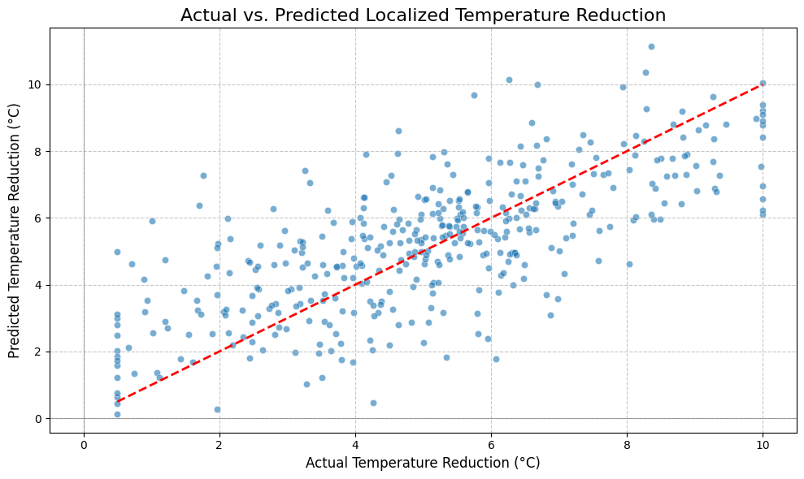

<!DOCTYPE html>
<html lang="en">
<head>
  <meta charset="UTF-8">
  <meta name="viewport" content="width=device-width, initial-scale=1">

</head>
<body>

  <h1>📦 Project Name</h1>
  
A short description of your project goes here. Describe what it does, what tech it uses, and why it's useful.

  <h2>📥 Installation</h2>
  <pre><code>git clone https://github.com/rushigund/microclimate_prediction.git
cd your-repo
pip install -r requirements.txt</code></pre>

  <h2>🚀 Usage</h2>
  
Explain how to run or use your project:

  <pre><code>python main.py --input input.jpg --output output.jpg</code></pre>

  <h2>🖼️ Output Images</h2>
  

    <h3>Original Image</h3>
    

    <h3>Processed Output</h3>
    

    <!-- Add more images as needed -->
  

  <h2>🤝 Contributing</h2>
  
Pull requests are welcome. For major changes, please open an issue first to discuss what you would like to change.

  <h2>📄 License</h2>
  
This project is licensed under the MIT License - see the <code>LICENSE</code> file for details.

</body>
</html>
